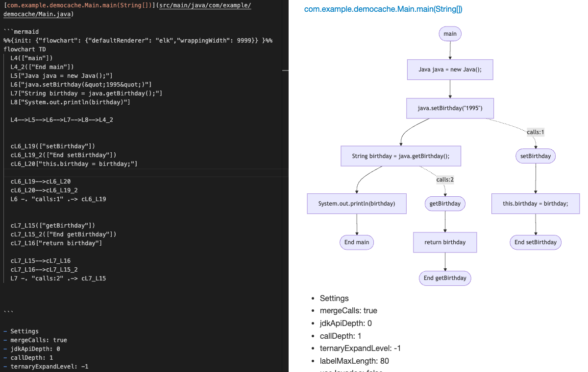
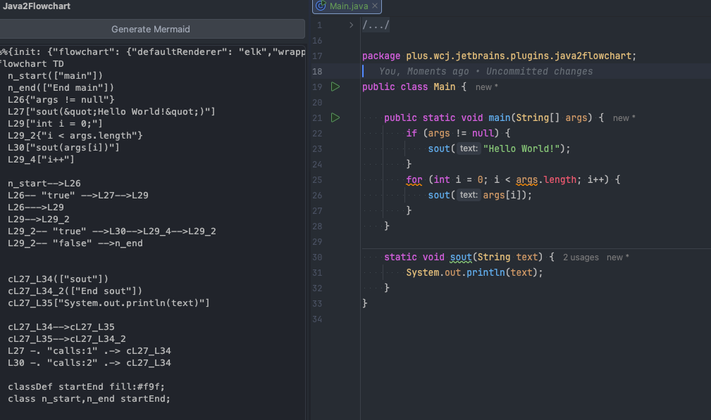
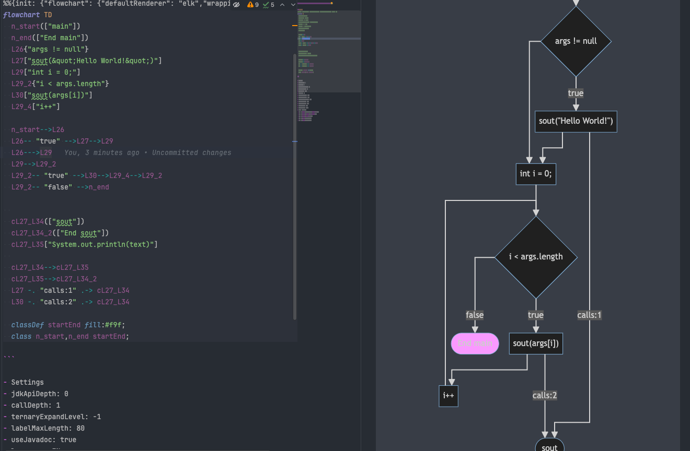

> @author ChangJin Wei (魏昌进)
# Java2Flowchart：一款把 Java 方法一键转换成 Mermaid 流程图的 IntelliJ 插件

在阅读复杂 Java 代码时，最耗费时间的往往不是语法，而是**理解控制流**：  
这个方法到底先走哪条分支？循环是怎么退出的？异常处理会不会改变主流程？某个调用链会不会继续向下展开？

如果你也经常被这些问题困扰，那么 **Java2Flowchart** 这个 IntelliJ 插件会非常实用。  
它可以直接在 JetBrains 系列 IDE 中，将 Java 方法转换成 **Mermaid 流程图**，帮助你快速把一段代码“看成图”。

本文将从功能、用法、配置和适用场景几个方面，介绍这款插件的实际价值和使用方式。

---

## 一、Java2Flowchart 是什么？

Java2Flowchart 是一个面向 IntelliJ IDEA 的 Java 流程图生成插件。  
它的核心能力是：**分析 Java 方法的控制流，并输出为 Mermaid 格式的 Markdown 文件**。

简单来说，你在 IDE 中选中一个 Java 方法，插件就能自动把它转换成一张流程图，方便你：

- 快速理解复杂逻辑
- 复盘代码执行路径
- 文档化方法行为
- 做代码评审或重构分析

它不是简单地把源码“贴到图里”，而是会分析方法内部的结构和调用关系，因此生成的流程图更接近真实执行逻辑。

---

## 二、插件能做什么？

Java2Flowchart 支持的内容比较丰富，覆盖了大多数常见 Java 控制结构。

### 1. 基本控制流
插件可以识别：

- `if / else`
- `else if`
- `for`
- `foreach`
- `while`
- `do-while`
- `switch`
- `try / catch / finally`
- `return`
- `break`
- `continue`
- `throw`

这些结构会被转换为 Mermaid 图中的不同节点和连接关系，便于直观看出流程走向。

### 2. 表达式级别的展开
除了语句级控制流，插件还支持一些常见表达式的处理，例如：

- 三元表达式 `?:`
- `switch expression`
- `yield`

这对于现代 Java 代码尤其重要，因为很多返回逻辑已经不再只是简单的 `if-else`。

### 3. 方法调用与调用链
这是这款插件比较亮眼的功能之一。

它不仅会显示当前方法内部的语句流程，还会尽量识别：

- 普通方法调用
- 嵌套调用
- 调用链
- 递归调用
- JDK API 调用

并且可以根据配置决定是否继续展开这些调用。  
这样你就能既看到主流程，也能看到调用上下文。

### 4. Mermaid 输出
插件最终输出的是 **Mermaid flowchart**，也就是 Markdown 里常见的流程图语法。  
这意味着生成结果可以直接用于：

- GitHub / GitLab 文档
- 技术博客
- 设计说明
- 团队知识库
- README

---

## 三、如何使用？

Java2Flowchart 的使用方式非常简单，几乎不需要额外学习成本。

### 方法一：通过 Generate 菜单生成
在 Java 方法中放置光标后，可以通过 IDE 的 **Generate** 菜单触发生成流程图功能。

### 方法二：使用快捷键
默认快捷键是：

- **Windows / Linux**：`Ctrl + Alt + Shift + F`
- **macOS**：`⌥ + ⇧ + ⌘ + F`

触发后，插件会生成一个 Markdown 文件，通常存放在项目根目录下的 `Java2Flowchart/` 目录中。  
文件名会包含包名、类名和方法名，方便定位。

### 生成结果怎么查看？
生成的 Markdown 文件中包含 Mermaid 图代码，你可以：

- 直接在支持 Mermaid 的 IDE / 编辑器里预览
- 复制到博客或文档中
- 作为设计说明的一部分保存

---

## 四、插件适合哪些场景？

### 1. 阅读陌生代码
接手老项目时，最常见的问题就是“不知道这个方法到底干了什么”。  
流程图比纯文本更容易帮助你建立整体认知。

### 2. 分析复杂分支逻辑
如果一个方法中有大量 `if/else`、`switch`、异常处理和循环嵌套，用图来看会更清晰。

### 3. 调试与排错
当你怀疑某段逻辑有问题时，流程图可以帮助你快速确认：

- 哪些路径能走到这里
- 哪些分支会提前返回
- 哪些异常会中断主流程

### 4. 重构前分析
重构之前，先把核心方法转成流程图，往往更容易看出：

- 哪些逻辑可以抽取
- 哪些分支重复
- 哪些调用链过长

### 5. 写文档和做分享
Mermaid 图非常适合放进技术博客、API 文档和架构说明中。  
比单纯贴代码更直观，也更容易被团队成员接受。

---

## 五、插件有哪些可配置项？

Java2Flowchart 的一个优点是：**可配置项比较多，而且都围绕“图是否清晰”这个核心目标设计**。

你可以在：

**File | Settings | Tools | Java2Flowchart**

中找到相关设置。

### 1. 折叠线性逻辑
插件提供多种“折叠”选项，例如：

- 折叠 fluent 调用
- 折叠嵌套调用
- 折叠连续调用
- 折叠连续 setter
- 折叠连续 getter
- 折叠连续构造器调用

这些选项的作用是减少图中不必要的碎节点，让流程图更紧凑。

### 2. 调用展开深度
插件允许你控制调用展开的层数，包括：

- `callDepth`：普通方法调用展开深度
- `jdkApiDepth`：JDK API 调用展开深度

如果你只想看当前方法主流程，可以把展开深度调低。  
如果你正在追查调用链，可以适当调高。

### 3. 三元表达式展开
你可以设置三元表达式的展开层级：

- `-1`：完全展开
- `0`：不展开
- `N`：展开 N 层

这在分析复杂返回逻辑时很有用。

### 4. 节点标签长度
为了防止节点文本过长影响可读性，插件提供了标签最大长度设置。  
这样可以避免 Mermaid 图横向拉得太宽。

### 5. 语言切换
插件支持 **中文 / 英文** 两种界面语言。  
对于中文用户来说，操作和配置理解起来会更友好。

### 6. 跳过规则
插件还支持通过正则表达式配置“跳过哪些方法调用不渲染”。  
例如一些常见的 getter、setter、`toString`、`hashCode` 等方法，可以在图中自动忽略，避免图形过于冗长。

### 7. 导出源代码
如果你希望生成的 Markdown 中同时包含源代码，插件也提供了相关开关。  
这样可以把流程图和源码一起展示，便于对照阅读。

---

## 六、它是怎么工作的？

从实现思路上看，Java2Flowchart 采用了比较清晰的三层结构：

### 1. 解析层
先分析 Java 方法的语法结构，识别其中的条件分支、循环、返回、调用等信息。

### 2. 中间表示层
把这些信息转换成内部控制流图，用节点和边描述整个方法的执行关系。

### 3. 渲染层
最后再把控制流图转换成 Mermaid 语法，输出为 Markdown。

这种设计的好处是：

- 结构清晰
- 易于扩展
- 渲染结果稳定
- 后续可以支持更多图形格式

---

## 七、使用这个插件的几个建议

如果你是第一次使用 Java2Flowchart，建议先用一套比较保守的配置：

- `callDepth = 1`
- `jdkApiDepth = 0`
- 开启折叠连续调用
- 开启 Javadoc 标签
- 标签长度保持适中

这样生成的图通常不会太大，适合先快速理解方法主干。

如果你在分析特别复杂的业务逻辑，再逐步增加展开深度。  
否则图可能会因为展开过度而变得难以阅读。

---

## 八、优点与不足

### 优点
- 集成在 IntelliJ IDEA 中，使用方便
- 支持多种 Java 控制流结构
- 可视化效果清晰
- Mermaid 格式适合文档和博客
- 配置项丰富，灵活度高

### 不足
- 对超长方法，生成的图仍可能比较大
- 动态调用、反射等复杂场景无法完全还原
- 如果代码本身结构混乱，流程图也会变复杂
- 适合辅助理解，不适合作为唯一的分析手段

---

## 九、适合谁使用？

这款插件比较适合以下人群：

- Java 开发者
- 接手遗留系统的工程师
- 需要做代码评审的人
- 经常写技术文档的人
- 希望把方法逻辑图形化的团队

尤其是在阅读复杂业务代码、重构核心方法、做设计说明时，它能明显提升理解效率。

---

## 十、总结

Java2Flowchart 的价值，不在于“生成一张漂亮的图”，而在于它帮助开发者**更快理解 Java 方法的真实执行路径**。

它把方法中的分支、循环、异常、调用链等信息转换成 Mermaid 流程图，让原本需要反复阅读源码的过程，变成了更直观的图形化分析。

如果你经常和复杂 Java 逻辑打交道，这个插件值得一试。

